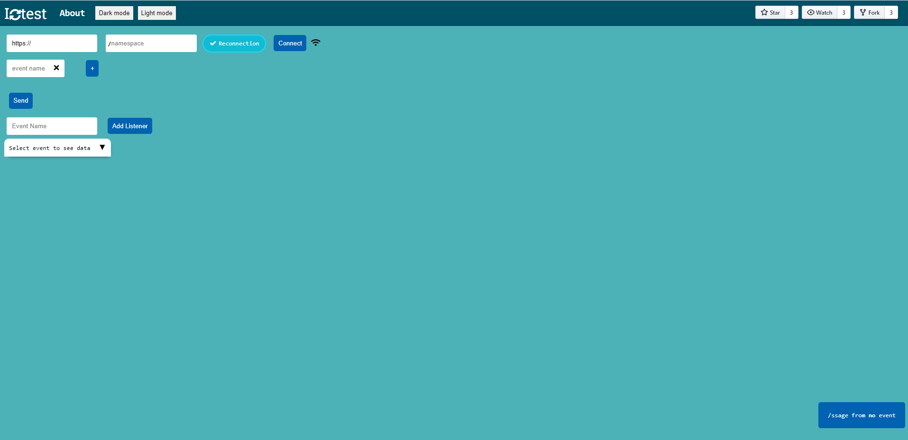

# Iotest ([testio.js.org](https://testio.js.org))

Iotest is a simple but useful online tool for **Socket.io** testing [io-tester.herokuapp.com](http://io-tester.herokuapp.com/). 

Socket.io enables real-time bidirectional and event-based communication between the browser and the server. This application allows you to enter the server URL and test for a connection.

## Installation

Use the package manager [npm](https://www.npmjs.com/) to install Iotest.

```bash
$ git clone https://github.com/yavrumian/test.io
$ cd test.io
$ npm i
```

## Usage
Run 
```bash
$ npm start
```

Then simply visit `http://localhost:8080` to use iotest (you can also change the **port** variable in `/iotest/app.js` to run tool on another port).

After following the above steps, the application should look like this:




## Contributing
We welcome contributions from everyone, especially new contributors. Simply submit a Pull Request with a clear description and title.  

Please follow the below steps when submitting a PR:
1. If you plan on making significant changes please first open an issue to discuss what you would like to change.
2. Fork the repository to create your own copy..
3. Setup and run the development environment by following the Installation and Usage instructions above. Make sure to replace the git clone link with your forked repository URL.
4. Create and checkout your own branch.
```bash
git branch <branch_name>
git checkout -b <branch_name>
```
5. Make your changes.
6. Run **and update** tests as appropriate.
7. Push your changes to your branch. 
8. Open a Pull Request on the parent project.

## License
This project is licensed under the MIT License. See the [MIT](https://choosealicense.com/licenses/mit/) site for details.
